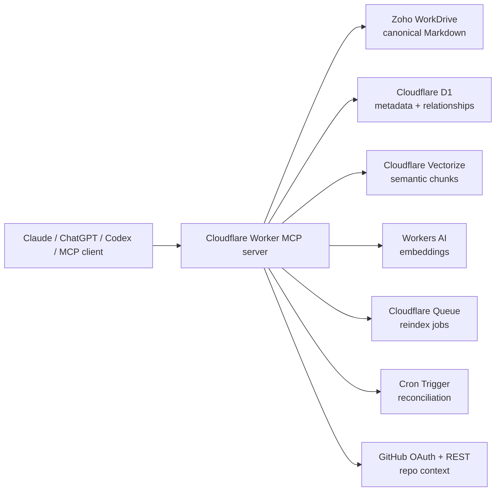

# Architecture

Context OS MCP is a remote MCP server for durable assistant context.

The system separates four concerns:

- Canonical human-readable memory lives in Zoho WorkDrive as Markdown.
- Structured metadata and relationships live in Cloudflare D1.
- Semantic retrieval lives in Cloudflare Vectorize.
- Session orchestration lives in the MCP service layer.

## System Map

## Context OS Layer

The most important tool is `prepare_assistant_session`.

It returns a session plan instead of raw search results:

- active project and project-switching reason
- candidate and related projects
- validated time/date/weekday/timezone context
- weekend, business-day, business-hour, and actionability assessment
- deterministic request classification and required tool plan
- linked initiative context
- canonical current context
- grouped memory results
- linked entities, facts, tasks, and source events
- context health warnings
- recommended live MCP checks
- write-back policy

This lets the assistant understand "what world am I in?" before it starts answering or acting.

## Reliability Core

Phase 1 reliability planning is computed at request time and does not require new D1 tables.

- `get_operational_context` validates IANA timezone, current local date, weekday, weekend/business-day status, business hours, and public-holiday placeholder state.
- `plan_assistant_action` classifies the request, assesses actionability, identifies required/optional tools, lists confirmation-gated actions, and recommends safe write-back tools.
- `prepare_assistant_session` includes the same reliability fields additively so older clients keep working while newer clients can follow the richer plan.

The reliability core uses generic rule sets and connector policy defaults only. It must not depend on private customer names, tenant IDs, secrets, or personal data.

## Durable Memory Model

Document memory:

- `current_context`
- `historical_note`
- `decision`
- `session_summary`
- `snippet`
- `repo_index`

Structured memory:

- `initiative`
- `project`
- `entity`
- `fact`
- `task`
- `source_event`
- `memory_link`
- `connector_policy`

## External Source Strategy

Live systems remain the source of truth for volatile data:

- CRM
- email
- calendar
- notes
- GitHub
- Shopify
- WorkDrive files

Memory stores durable summaries, source pointers, state changes, deadlines, facts, decisions, tasks, and relationships. It should not become a blind full mirror of private external systems.

## Retrieval Strategy

Retrieval combines:

- Vectorize semantic search across project and shared namespaces.
- D1 keyword search for titles, paths, tags, repos, source URLs, and exact matches.
- Project-aware ranking.
- Grouped results by memory type.
- Diagnostics that distinguish keyword fallback, missing indexes, namespace mismatch, and likely embedding/filter issues.

Project scope is enforced by metadata, not by private-name filters. A search for project `<project-slug>` may include documents from `<project-slug>` and the reserved `shared` namespace. A search for `shared` stays in the shared namespace. Other project namespaces are not visible unless they are explicitly linked through initiative, entity, or related-project scope.

## Compatibility

`prepare_work_session` remains available for older clients. New clients should use `prepare_assistant_session`.
