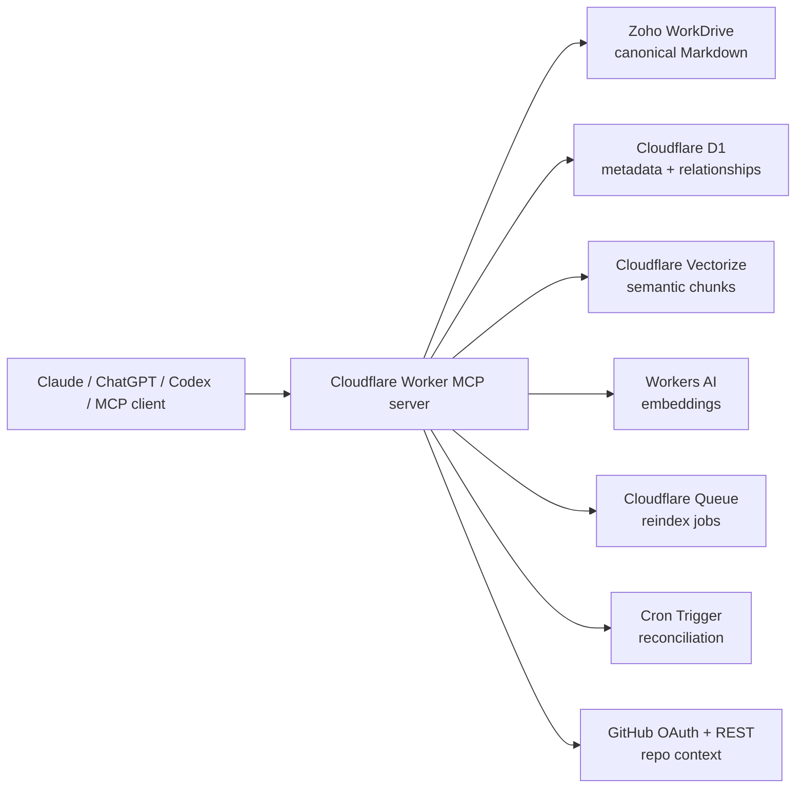
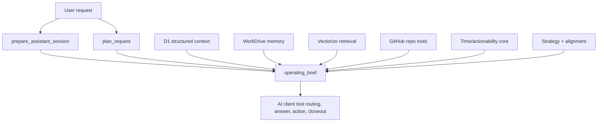

# Architecture

Context OS MCP is a remote MCP server for durable assistant context.

The system separates four concerns:

- Canonical human-readable memory lives in Zoho WorkDrive as Markdown.
- Structured metadata and relationships live in Cloudflare D1.
- Semantic retrieval lives in Cloudflare Vectorize.
- Session orchestration lives in the MCP service layer.
- Environment-aware capability planning tells each AI client how to use tools available in its own host.

## System Map

## Context OS Layer

The Context OS layer has two high-level client entrypoints:

- `prepare_assistant_session` boots the session and remains backward-compatible with older clients.
- `plan_request` is the main "How do I achieve X?" and "What should I do next?" planning tool.

Both return an `operating_brief` instead of leaving clients to assemble raw search results:

- active project and project-switching reason
- candidate and related projects
- validated time/date/weekday/timezone context
- weekend, business-day, business-hour, and actionability assessment
- deterministic request classification and required tool plan
- required live checks with explicit unavailable-tool warnings
- linked initiative context
- canonical current context
- grouped memory results
- linked entities, facts, tasks, and source events
- compact strategic world model context
- context health warnings
- safe next actions and confirmation guardrails
- write-back policy
- environment/tool guidance for Claude, ChatGPT, Codex, generic MCP clients, local CLI, or other clients

This lets the assistant understand "what world am I in?" before it starts answering or acting.

## Environment Capability Layer

ContextOS should not directly own every possible MCP server, connector, app, or API. Instead, it stores and returns capability manifests:

- `client_environments`: known client hosts such as `claude`, `chatgpt`, `codex`, `generic_mcp`, `local_cli`, and `other`.
- `tool_capabilities`: source/action/sensitivity/write-policy metadata for memory, GitHub, WorkDrive, CRM, mail, calendar, Shopify, Cloudflare, terminal, migration, and durable write-back.
- `environment_capabilities`: per-environment availability, invocation style, tool name, usage instructions, limitations, and priority.
- `plan_environment_tool_use`: resolves the current environment, compares required capabilities with `available_tools`, separates ContextOS-executable checks from client-executed checks, and returns confirmation gates and fallback plans.

This keeps client instructions thin: call ContextOS first, follow returned environment-specific instructions, then record what was checked and what remains unverified.

## Operating Brief Composition

The operating brief is computed at request time. It does not require its own persistence table.

- `context_resolution` tells the client which project/world it is in.
- `time_actionability` gives date, weekday, timezone, business-day status, safe actions, deferrals, and guardrails.
- `strategic_alignment` summarizes goals, initiatives, milestones, branch-project protocol, and alignment assessment.
- `relevant_assets` exposes resources and whether a live source should be checked before use.
- `current_tasks_milestones` surfaces open, due, blocked, high-priority, and overdue work.
- `source_freshness` reports stale, missing, keyword-only, vector, project-health, and repo-index signals.
- `required_live_checks` gives concrete tool names, source kind, timing, availability, blocking status, and fallback behavior.
- `risks` collects strategy, actionability, stale-context, privacy, missing-tool, and confirmation risks.
- `recommended_next_actions` separates before-answer, before-action, before-write, safe-now, deferred, and confirmation-needed steps.
- `write_back_plan` tells clients what to save durably and what content must remain live-only or approval-gated.

## Reliability Core

Phase 1 reliability planning is computed at request time and does not require new D1 tables.

- `get_operational_context` validates IANA timezone, current local date, weekday, weekend/business-day status, business hours, and public-holiday placeholder state.
- `plan_assistant_action` classifies the request, assesses actionability, identifies required/optional tools, lists confirmation-gated actions, and recommends safe write-back tools.
- `prepare_assistant_session` includes the same reliability fields additively so older clients keep working while newer clients can follow the richer plan.

The reliability core uses generic rule sets and connector policy defaults only. It must not depend on private customer names, tenant IDs, secrets, or personal data.

## Strategic World Model

Phase 2 adds a project-scoped strategic model in D1 while keeping long-form strategy narratives in WorkDrive memory documents.

- `strategy_nodes` stores visions, north stars, strategic pillars, and outcomes.
- `assets` stores reusable resources with live-source pointers, sensitivity, limitations, and usage guidance.
- `milestones` stores strategic checkpoints that can link to initiatives, projects, and outcomes.
- `branch_projects` stores the mandatory protocol for short-term projects and experiments.
- `alignment_assessments` stores explainable alignment checks when a client explicitly asks to save them.

`get_strategy_context` returns a compact strategic summary. `plan_request` composes that context with Phase 1 time/actionability and tool-policy planning, active tasks, assets, memory retrieval, and deterministic alignment scoring.

The source tree must not include private customer data, secrets, personal strategy, or tenant-specific examples. Generic fixtures belong in tests; real strategy belongs in memory/D1 data.

## Durable Memory Model

Document memory:

- `current_context`
- `historical_note`
- `decision`
- `session_summary`
- `snippet`
- `repo_index`

Structured memory:

- `initiative`
- `project`
- `entity`
- `fact`
- `task`
- `source_event`
- `memory_link`
- `connector_policy`
- `strategy_node`
- `asset`
- `milestone`
- `branch_project`
- `alignment_assessment`

## External Source Strategy

Live systems remain the source of truth for volatile data:

- CRM
- email
- calendar
- notes
- GitHub
- Shopify
- WorkDrive files

Memory stores durable summaries, source pointers, state changes, deadlines, facts, decisions, tasks, and relationships. It should not become a blind full mirror of private external systems.

## Retrieval Strategy

Retrieval combines:

- Vectorize semantic search across project and shared namespaces.
- D1 keyword search for titles, paths, tags, repos, source URLs, and exact matches.
- Project-aware ranking.
- Grouped results by memory type.
- Diagnostics that distinguish keyword fallback, missing indexes, namespace mismatch, and likely embedding/filter issues.
- Full Vectorize metadata retrieval for search hydration, with unfiltered fallback diagnostics when metadata-filtered semantic search returns no hits despite D1 chunks.

Project scope is enforced by metadata, not by private-name filters. A search for project `<project-slug>` may include documents from `<project-slug>` and the reserved `shared` namespace. A search for `shared` stays in the shared namespace. Other project namespaces are not visible unless they are explicitly linked through initiative, entity, or related-project scope.

## Non-Destructive Migration

The memory migration tools are metadata-first and history-preserving:

- `analyze_memory_migration` is read-only and reports duplicate projects, duplicate/stale current-context docs, placeholder docs, vector gaps, and proposed links.
- `run_memory_migration` defaults to dry-run and only applies metadata-safe aliases, canonical/merged markers, graph links, audit events, and source-event summaries when `apply=true`.
- WorkDrive files, D1 rows, snapshots, queues, OAuth data, and Vectorize data are never deleted by these tools.

## Compatibility

`prepare_work_session` remains available for older clients. New clients should use `prepare_assistant_session`.
