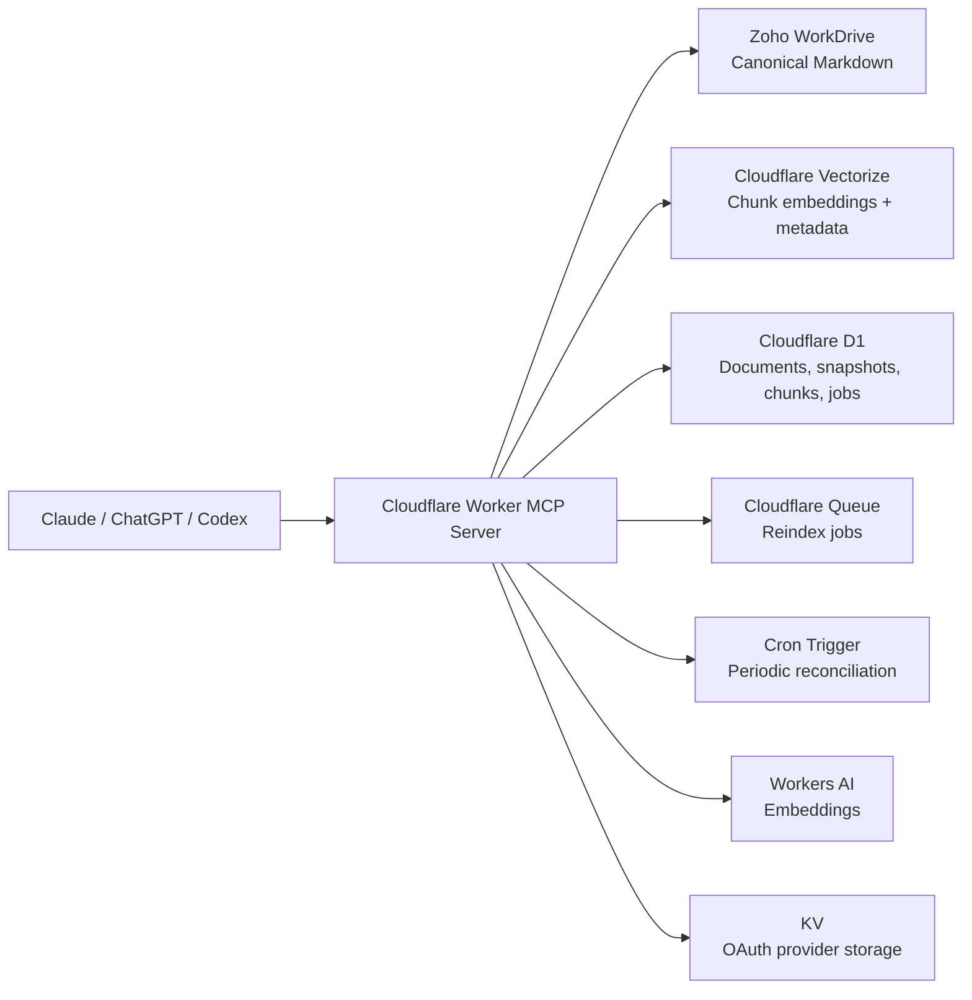

# Deployment And Operations Guide

## Purpose

This project exposes a single remote MCP server on Cloudflare Workers for shared AI context across Anthropic Claude, OpenAI ChatGPT, OpenAI Codex, and other MCP-capable clients.

The canonical source of truth is Markdown stored in Zoho WorkDrive. The Worker:

- reads and writes canonical Markdown in WorkDrive
- chunks Markdown into retrieval units
- generates embeddings with Cloudflare Workers AI
- stores embeddings and filterable metadata in Cloudflare Vectorize
- stores operational metadata, chunk manifests, sync state, indexing jobs, initiatives, entities, facts, tasks, source events, links, and connector policies in Cloudflare D1
- exposes MCP tools over Streamable HTTP at `/mcp`
- returns server-generated assistant session plans through `prepare_assistant_session`

## Architecture



## Official References

- Cloudflare remote MCP on Workers: [Build a Remote MCP server](https://developers.cloudflare.com/agents/guides/remote-mcp-server/)
- Cloudflare MCP handler API: [createMcpHandler](https://developers.cloudflare.com/agents/model-context-protocol/mcp-handler-api/)
- Cloudflare MCP security and OAuth provider guidance: [Securing MCP servers](https://developers.cloudflare.com/agents/guides/securing-mcp-server/)
- Cloudflare D1 commands: [D1 Wrangler commands](https://developers.cloudflare.com/d1/wrangler-commands/)
- Cloudflare Vectorize creation and metadata indexing: [Create indexes](https://developers.cloudflare.com/vectorize/best-practices/create-indexes/) and [Vectorize Wrangler commands](https://developers.cloudflare.com/vectorize/reference/wrangler-commands/)
- Cloudflare Queue commands: [Queues Wrangler commands](https://developers.cloudflare.com/workers/wrangler/commands/queues/)
- Cloudflare KV commands: [Wrangler KV commands](https://developers.cloudflare.com/kv/reference/kv-commands/)
- Cloudflare Cron Triggers: [Cron Triggers](https://developers.cloudflare.com/workers/configuration/cron-triggers/)
- Cloudflare Workers AI binding: [Workers AI bindings](https://developers.cloudflare.com/workers-ai/configuration/bindings/)
- Zoho OAuth: [OAuth 2.0 overview](https://www.zoho.com/accounts/protocol/oauth.html) and [scope syntax](https://www.zoho.com/accounts/protocol/oauth/scope.html)
- Zoho WorkDrive API entrypoint: [WorkDrive API Documentation](https://workdrive.zoho.com/apidocs/v1/)
- Zoho official WorkDrive examples showing API URL families: [Create Folder](https://www.zoho.com/deluge/help/workdrive/create-folder.html) and [Upload File](https://www.zoho.com/deluge/help/workdrive/upload-file.html)
- GitHub OAuth app setup: [Creating an OAuth app](https://docs.github.com/en/developers/apps/creating-an-oauth-app) and [Authorizing OAuth apps](https://docs.github.com/apps/building-oauth-apps/authorizing-oauth-apps)
- GitHub OAuth scopes and repo access: [Scopes for OAuth apps](https://docs.github.com/en/apps/oauth-apps/building-oauth-apps/scopes-for-oauth-apps) and [REST API authentication](https://docs.github.com/en/rest/authentication/authenticating-to-the-rest-api)
- Anthropic remote MCP support: [MCP connector](https://docs.anthropic.com/en/docs/agents-and-tools/mcp-connector) and [Custom connectors](https://support.anthropic.com/en/articles/11175166-getting-started-with-custom-integrations-using-remote-mcp)
- OpenAI MCP guidance: [Building MCP servers for ChatGPT and API integrations](https://platform.openai.com/docs/mcp/) and [ChatGPT developer mode](https://platform.openai.com/docs/guides/developer-mode)
- OpenAI Codex MCP quickstart example: [Docs MCP](https://platform.openai.com/docs/docs-mcp)
- MCP specification: [Lifecycle](https://modelcontextprotocol.io/specification/2025-03-26/basic/lifecycle) and [Transports](https://modelcontextprotocol.io/specification/2025-03-26/basic/transports)

## Repository Layout

```text
src/
  index.ts
  auth/
  config/
  domain/
  integrations/
  mcp/
  persistence/
migrations/
tests/
docs/
```

## Markdown Memory Layout

Canonical WorkDrive layout:

```text
/memory/shared/
  context/current/
  context/history/
  decisions/
  sessions/
  snippets/
  repo-index/
/memory/projects/<project-slug>/
  context/current/
  context/history/
  decisions/
  sessions/
  snippets/
  repo-index/
```

### Frontmatter schema

Every canonical or generated Markdown document uses YAML frontmatter with:

- `id`
- `title`
- `project`
- `memory_type`
- `status`
- `revision`
- `tags`
- `created_at`
- `updated_at`
- `author_client`
- `source`
- `source_urls`
- `confidence`
- `usefulness`
- `repo`
- `path`
- `supersedes`
- `superseded_by`
- `canonical`

### Supported `memory_type` values

- `current_context`
- `historical_note`
- `decision`
- `session_summary`
- `snippet`
- `repo_index`

### Supported `status` values

- `active`
- `historical`
- `superseded`
- `archived`

## Canonical Update And Supersession Rules

- `update_context_document` writes the latest canonical truth into `context/current/`.
- If an existing canonical document is replaced, the previous revision is written into `context/history/` first.
- `record_decision` is append-only and creates new decision records instead of mutating prior ADR-style decisions.
- `write_session_summary` is append-only and never becomes canonical automatically.
- Superseded content is preserved in Markdown history and additionally represented in D1 / Vectorize metadata.

## Indexing Strategy

### Embeddings

- Model: `@cf/baai/bge-base-en-v1.5`
- Dimension: `768`
- Distance metric: `cosine`

### Chunking

- heading-aware Markdown chunking
- target size around `320` tokens
- overlap around `64` tokens
- hard-cap enforcement to stay under the embedding model limit once headers are added

### Vectorize namespace model

- namespace `shared` for shared memory
- namespace `<project-slug>` for project memory

### Vector metadata schema

- `doc_id`
- `snapshot_id`
- `project`
- `path`
- `workdrive_file_id`
- `title`
- `memory_type`
- `status`
- `active`
- `superseded`
- `repo`
- `repo_path`
- `tags`
- `source`
- `confidence`
- `usefulness`
- `updated_at_unix`
- `heading_path`
- `chunk_index`
- `revision`
- `url` when available

### Recommended metadata indexes

Create metadata indexes for:

- `project` as `string`
- `memory_type` as `string`
- `status` as `string`
- `active` as `boolean`
- `superseded` as `boolean`
- `updated_at_unix` as `number`
- `repo` as `string`
- `path` as `string`
- `source` as `string`

## Retrieval Flow

1. The MCP tool receives a query.
2. The Worker generates an embedding using Workers AI.
3. The Worker queries Vectorize in the shared namespace plus the selected project namespace.
4. Vectorize metadata filters narrow results by project, type, status, activity, supersession, repo, path, and source where available.
5. D1 keyword search supplements semantic search for exact titles, paths, repo names, tags, and source URLs.
6. The Worker reranks results to favor exact project matches, active current context, decisions, associated repo/path matches, confidence/usefulness, and freshness.
7. The Worker optionally hydrates authoritative file contents from WorkDrive for top documents before returning them.

## Reindexing Flow

There are two reindex paths:

- write-through reindexing after MCP write tools succeed
- reconciliation reindexing from the scheduled scan of WorkDrive roots

### Write-through

- MCP write tool uploads canonical Markdown to WorkDrive
- Worker enqueues a document reindex job
- Queue consumer downloads Markdown, parses frontmatter, chunks content, embeds chunks, upserts Vectorize, and updates D1

### Reconciliation

- Cron trigger walks the configured WorkDrive roots
- it compares remote modified timestamps with D1 metadata
- stale or unseen files are re-enqueued for indexing

## D1 Data Model

Tables created by `migrations/0001_initial.sql`:

- `documents`
- `document_snapshots`
- `chunks`
- `supersessions`
- `reindex_jobs`
- `sync_runs`

`documents` tracks the current view of each file. `document_snapshots` keeps immutable indexed revisions. `chunks` maps chunk text to vector IDs. `reindex_jobs` and `sync_runs` support operations and debugging.

Tables added by `migrations/0002_projects_github_metadata.sql`:

- `projects`
- `project_aliases`
- `project_github_repos`
- `project_folder_checks`
- `repo_index_jobs`
- `memory_write_dedup`
- `admin_events`

The second migration also adds source/repo/tag/confidence/usefulness metadata to `documents`, hybrid retrieval fields to `chunks`, and extra job diagnostics to `reindex_jobs`.

Tables added by `migrations/0003_assistant_context_os.sql`:

- `initiatives`
- `initiative_projects`
- `memory_entities`
- `durable_facts`
- `context_tasks`
- `source_events`
- `memory_links`
- `connector_policies`
- `project_relations`

The third migration is additive. It preserves existing WorkDrive documents, document metadata, chunks, projects, GitHub metadata, and Vectorize data while enabling the Context OS relationship layer.

## MCP Tool Surface

### OpenAI-compatible tools

- `search`
- `fetch`

These exist specifically so OpenAI deep research and connector-style clients can consume the server using the documented `search` / `fetch` contract.

### Memory tools

- `prepare_assistant_session`
- `resolve_context`
- `prepare_work_session`
- `finish_work_session`
- `daily_briefing`
- `context_health_check`
- `list_initiatives`
- `get_initiative_context`
- `upsert_initiative`
- `upsert_task`
- `save_source_event`
- `extract_durable_facts`
- `link_memory`
- `bootstrap_project_context`
- `ensure_project`
- `list_projects`
- `get_project`
- `update_project_profile`
- `project_status`
- `search_memory`
- `get_document`
- `get_current_context`
- `write_session_summary`
- `save_snippet`
- `update_context_document`
- `record_decision`
- `github_find_repos`
- `github_project_repos`
- `github_associate_repo`
- `github_inspect_repo_structure`
- `github_index_repo_overview`
- `github_search_code`
- `github_get_file`
- `github_save_file_memory`
- `admin_status`
- `admin_reconcile_workdrive`
- `admin_reindex_document`
- `admin_reindex_all`
- `retrieval_diagnostics`

### Authorization notes

- read tools are marked with MCP `readOnlyHint`
- write tools are marked with destructive/idempotent hints where appropriate
- `reindex_all` is intended for administrators only

## Environment Variables

Use [`.env.example`](../.env.example) as the template.

### Cloudflare / Worker config

- `APP_BASE_URL`
  Source: your deployed `workers.dev` hostname or custom domain
- `MCP_ROUTE`
  Source: local project choice; default `/mcp`
- `ALLOWED_ORIGINS`
  Source: your browser-based MCP clients if you want explicit Origin allowlisting
- `WORKERS_AI_EMBEDDING_MODEL`
  Source: Cloudflare Workers AI model identifier

### Optional service auth

- `MCP_BEARER_TOKEN`
  Source: generate yourself; optional service-to-service token
- `ADMIN_GITHUB_LOGINS`
  Source: your GitHub usernames that may invoke admin tools

### GitHub OAuth for the Worker login flow

- `SESSION_SECRET`
  Source: generate locally, for example `openssl rand -hex 32`
- `GITHUB_OAUTH_CLIENT_ID`
  Source: GitHub OAuth App
- `GITHUB_OAUTH_CLIENT_SECRET`
  Source: GitHub OAuth App
- `GITHUB_OAUTH_AUTHORIZE_URL`
  Source: GitHub docs default value
- `GITHUB_OAUTH_TOKEN_URL`
  Source: GitHub docs default value
- `GITHUB_OAUTH_USER_URL`
  Source: GitHub API default value
- `GITHUB_OAUTH_EMAILS_URL`
  Source: GitHub API default value

### GitHub OAuth repository access

- `GITHUB_API_BASE_URL`
  Source: GitHub REST API base URL; default `https://api.github.com`
- `GITHUB_OAUTH_SCOPES`
  Source: GitHub OAuth scopes; default `read:user user:email repo`
- `GITHUB_ACCESS_TOKEN`
  Source: optional fallback token for local/dev automation; prefer `/login/github`
- `GITHUB_ALLOWED_REPOS`
  Source: optional comma-separated `owner/repo` allowlist; leave blank to allow every repo visible to the connected GitHub OAuth account

Repository tools use the connected GitHub OAuth account. After visiting `/login/github` and approving the requested scopes, the Worker stores the GitHub access token in KV for local MCP use. That lets bearer-token clients like Codex use the same connected GitHub account without passing GitHub secrets through the MCP client. Organization access depends on that organization allowing OAuth App access.

Available GitHub repo tools:

- `github_list_repos`
- `github_search_code`
- `github_get_file`
- `github_save_file_memory`

### Zoho WorkDrive

- `ZOHO_ACCOUNTS_BASE_URL`
  Source: Zoho Accounts region, commonly `https://accounts.zoho.com`
- `ZOHO_WORKDRIVE_API_BASE_URL`
  Source: Zoho WorkDrive API region, commonly `https://workdrive.zoho.com/api/v1`
- `ZOHO_WORKDRIVE_UPLOAD_URL`
  Source: your verified tenant-specific upload endpoint from Zoho’s official API explorer
- `ZOHO_ACCESS_TOKEN`
  Source: optional manual token for testing only
- `ZOHO_CLIENT_ID`
  Source: Zoho API Console
- `ZOHO_CLIENT_SECRET`
  Source: Zoho API Console
- `ZOHO_REFRESH_TOKEN`
  Source: generated through Zoho OAuth flow
- `WORKDRIVE_SHARED_ROOT_FOLDER_ID`
  Source: WorkDrive shared memory root folder ID
- `WORKDRIVE_PROJECTS_ROOT_FOLDER_ID`
  Source: WorkDrive projects root folder ID

## Create Cloudflare Resources

### 1. D1

Create the primary D1 database:

```bash
npx wrangler d1 create context-os-mcp
```

Create a second D1 database for preview if you want local or non-production isolation:

```bash
npx wrangler d1 create context-os-mcp-preview
```

Update `wrangler.jsonc` with the returned database IDs.

### 2. KV for OAuth state

Create production and preview namespaces:

```bash
npx wrangler kv namespace create OAUTH_KV
npx wrangler kv namespace create OAUTH_KV --preview
```

Update `wrangler.jsonc` with the returned IDs.

### 3. Queue

```bash
npx wrangler queues create memory-system-index-queue
```

The project already includes producer and consumer bindings in `wrangler.jsonc`.

### 4. Vectorize index

Create the index:

```bash
npx wrangler vectorize create memory-system-index --dimensions=768 --metric=cosine
```

Create metadata indexes:

```bash
npx wrangler vectorize create-metadata-index memory-system-index --propertyName project --type string
npx wrangler vectorize create-metadata-index memory-system-index --propertyName memory_type --type string
npx wrangler vectorize create-metadata-index memory-system-index --propertyName status --type string
npx wrangler vectorize create-metadata-index memory-system-index --propertyName active --type boolean
npx wrangler vectorize create-metadata-index memory-system-index --propertyName superseded --type boolean
npx wrangler vectorize create-metadata-index memory-system-index --propertyName updated_at_unix --type number
npx wrangler vectorize create-metadata-index memory-system-index --propertyName repo --type string
npx wrangler vectorize create-metadata-index memory-system-index --propertyName path --type string
npx wrangler vectorize create-metadata-index memory-system-index --propertyName source --type string
```

### 5. Workers AI binding

The `wrangler.jsonc` file already includes:

```json
"ai": {
  "binding": "AI"
}
```

No extra resource creation is needed beyond using a Cloudflare account with Workers AI access enabled.

## Create Zoho Credentials And Validate Endpoints

### OAuth scopes

Use the official Zoho OAuth scope syntax and request the least privileges that still allow your workflow. For this project, you will likely need WorkDrive file read and write scopes. Confirm the exact scope names for your tenant and region in Zoho’s official WorkDrive API documentation before production rollout.

### Steps

1. Create a client in the Zoho API Console and record the client ID and secret.
2. Complete the OAuth authorization flow to obtain a refresh token.
3. Confirm your WorkDrive API base URL and region.
4. In Zoho’s official WorkDrive API explorer, verify:
   - file metadata fetch
   - folder listing
   - file download
   - upload or new-version endpoint for Markdown writes
5. Put the verified upload URL into `ZOHO_WORKDRIVE_UPLOAD_URL`.

### Important Zoho caveat

This code intentionally refuses write operations unless `ZOHO_WORKDRIVE_UPLOAD_URL` is explicitly set. That is by design. Zoho’s public API surface is less straightforward than the Cloudflare and OpenAI docs, so the safest production path is to validate the exact upload endpoint against your tenant before enabling writes.

## Create The GitHub OAuth App

This project uses GitHub OAuth for the MCP server’s login flow because Cloudflare’s official remote MCP guidance includes a GitHub-based OAuth example.

In GitHub Developer Settings:

- Homepage URL: your deployed `APP_BASE_URL`
- Authorization callback URL: `${APP_BASE_URL}/auth/github/callback`

Store the resulting client ID and client secret in Worker secrets.

## Set Secrets And Vars

For sensitive values:

```bash
npx wrangler secret put SESSION_SECRET
npx wrangler secret put GITHUB_OAUTH_CLIENT_ID
npx wrangler secret put GITHUB_OAUTH_CLIENT_SECRET
npx wrangler secret put ZOHO_CLIENT_ID
npx wrangler secret put ZOHO_CLIENT_SECRET
npx wrangler secret put ZOHO_REFRESH_TOKEN
npx wrangler secret put ZOHO_ACCESS_TOKEN
npx wrangler secret put ZOHO_WORKDRIVE_UPLOAD_URL
npx wrangler secret put MCP_BEARER_TOKEN
```

Non-secret values can stay in `wrangler.jsonc` or environment-specific config.

## Prepare WorkDrive

Pre-create only the root folders:

```text
/memory/shared
/memory/projects
```

The `ensure_project` tool creates or repairs each project folder tree automatically:

```text
/memory/projects/<project>/context/current
/memory/projects/<project>/context/history
/memory/projects/<project>/decisions
/memory/projects/<project>/sessions
/memory/projects/<project>/snippets
/memory/projects/<project>/repo-index
```

Then capture the root folder IDs for:

- `WORKDRIVE_SHARED_ROOT_FOLDER_ID`
- `WORKDRIVE_PROJECTS_ROOT_FOLDER_ID`

## Local Development

Install and verify:

```bash
npm install
npm run typecheck
npm test
```

Apply migrations locally:

```bash
npx wrangler d1 migrations apply context-os-mcp --local
```

Run the Worker locally:

```bash
npm run dev
```

Health check:

```bash
curl http://localhost:8787/health
```

## Deploy

Apply migrations remotely before deploying code that depends on the new schema:

```bash
npx wrangler d1 migrations apply context-os-mcp --remote
```

```bash
npm run deploy
```

After deployment:

1. confirm `/health`
2. confirm `/mcp` is reachable
3. confirm GitHub login works
4. call `ensure_project` for one non-shared project
5. call `bootstrap_project_context`
6. call `github_associate_repo` and `github_index_repo_overview`
7. call `prepare_assistant_session` and verify active project, initiative context, grouped memory, context health, live MCP recommendations, and write-back policy
8. call `context_health_check` and `retrieval_diagnostics` for a broad query
9. run a staging write and reindex flow before pointing real AI clients at production

## Connect From Claude

### Claude UI custom connector

In Claude’s connector settings, add a remote MCP connector pointing to:

```text
https://YOUR_DOMAIN/mcp
```

Authenticate using the OAuth flow exposed by this Worker.

### Anthropic Messages API

Anthropic’s official MCP connector supports public HTTP MCP servers and tool calls. Use your deployed URL in `mcp_servers` and provide an authorization token only if you choose bearer-token auth instead of OAuth.

## Connect From ChatGPT / OpenAI

### ChatGPT developer mode

Enable ChatGPT developer mode, then add your remote MCP server URL:

```text
https://YOUR_DOMAIN/mcp
```

This server intentionally exposes both:

- `search`
- `fetch`

Those are the specific tools OpenAI documents for connector and deep-research-style data sources.

### OpenAI API / deep research

Use the same remote MCP server in the OpenAI API where MCP servers are supported. The `search` and `fetch` tools already match OpenAI’s documented response shapes.

## Connect From Codex

Codex supports MCP servers. Following OpenAI’s documented MCP quickstart pattern, add your server with the Codex CLI:

```bash
codex mcp add memorySystem --url https://YOUR_DOMAIN/mcp
```

Then verify:

```bash
codex mcp list
```

If you are using OAuth, complete the prompted auth flow. If you are using bearer-token auth, configure it according to Codex’s MCP configuration docs.

## Automated Verification

Current automated coverage:

- frontmatter parsing
- chunking behavior, including hard-cap handling
- ranking logic
- Vectorize query and metadata construction
- Zoho client token refresh and download behavior
- MCP tool registration and OpenAI-compatible `search` / `fetch` result shapes using the official MCP SDK in-memory transport
- indexing orchestration across chunking, embeddings, Vectorize upsert, and repository persistence boundaries using mocked integrations

Run:

```bash
npm run typecheck
npm test
```

## Staging Verification Runbook

Because this repository does not include live Cloudflare account state or Zoho tenant credentials, you should run this staging flow before production use:

1. Deploy to a non-production Worker domain.
2. Point the Worker at staging D1, KV, Queue, Vectorize, and WorkDrive folders.
3. Create one canonical Markdown file under `/memory/shared/context/current/`.
4. Call `reindex_document` or wait for reconciliation.
5. Confirm a Vectorize match exists for the new file.
6. Call `prepare_assistant_session` for the project and verify the file appears in grouped memory or current context.
7. Call `search_memory` with an exact phrase from the file.
8. Call `fetch` for the returned document ID and confirm the authoritative text.
9. Use `update_context_document` to revise the file and confirm:
   - prior content is written into `context/history/`
   - a new snapshot is written
   - retrieval prefers the latest active context
10. Test `upsert_initiative`, `upsert_task`, `save_source_event`, `extract_durable_facts`, and `link_memory` against staging data.
11. Test an external manual edit in WorkDrive and wait for the cron reconciliation path to enqueue and reindex it.
12. Connect one real client each from Claude, ChatGPT developer mode, and Codex.

## Known Limitations

- Existing Markdown memory is preserved and still searchable, but it is not automatically converted into structured entities, facts, tasks, and source events. Assistants should extract durable structure opportunistically during real work.
- Broad semantic queries may still fall back to keyword-only retrieval if Vectorize returns no semantic hits. `context_health_check` and `retrieval_diagnostics` expose this instead of hiding it.
- Zoho write-path verification still depends on tenant-specific validation of the upload endpoint. The code is explicit about this and will not pretend otherwise.
- The local automated suite uses mocked integration boundaries for Zoho, Vectorize, Workers AI, and D1-adjacent orchestration. It does not prove live provider interoperability by itself.
- Anthropic remote MCP currently supports tools only, not full MCP resources/prompts.
- ChatGPT deep-research compatibility depends primarily on the `search` and `fetch` tool contract; richer write tools are intended for developer mode and compatible MCP clients.
- Cron Triggers run in UTC. If you need region-specific reconciliation windows, plan around UTC or deploy environment-specific schedules.
- This implementation assumes an English-first embedding model. If multilingual retrieval becomes a core requirement, create a new index and migrate consistently rather than mixing embedding models inside one index.

## Operational Notes

- `reindex_all` is admin-only by design.
- `MCP_BEARER_TOKEN` is optional. OAuth is the better default for user-facing client connections.
- If a WorkDrive file is edited outside the MCP write tools, semantic relationships like `supersedes` are only preserved if the file frontmatter is updated accordingly.
- If you rotate the embedding model or vector dimension, create a new Vectorize index and perform a full reindex.

## What Was Verified Here

Verified in this repo:

- implementation compiles
- automated tests pass locally
- tool contracts and indexing orchestration behave as designed under controlled mocks
- production deployment and additive migration were smoke-tested on the maintainer's Cloudflare account on 2026-05-01
- `prepare_assistant_session`, `get_initiative_context`, and `context_health_check` were smoke-tested against production memory

Not yet verified in this repo alone:

- end-user OAuth sign-in in a deployed environment
- production client onboarding from Claude, ChatGPT, and Codex

That separation is intentional so the documentation stays accurate.
